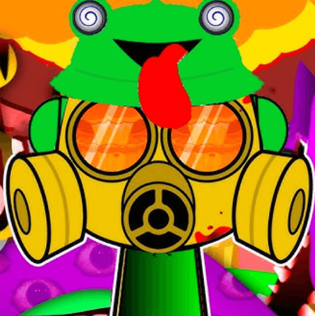

# Sprunki Phase 4

## Overview

Welcome to Sprunki Phase 4, an innovative iteration in the Sprunki series that focuses on creative sound design and interactive musical experiences. This version represents a significant evolution in how passive items interact with sound elements, creating a unique and engaging gameplay experience.

## Key Features

### Passive Item Evolution
- **Interactive Sound Sprite**: A friendly sprite that follows you, creating dynamic sound patterns based on your movements
- **Transformative Abilities**: Under specific conditions, Sprunki transforms into Windgunner, offering enhanced sound manipulation capabilities
- **Random Trigger System**: Each Sprunki acquisition comes with randomized activation conditions, creating unique sound experiences
- **Literary Inspiration**: Drawing inspiration from the "Stormlight Archive" series, where Spren-like entities influence the sonic landscape

### Character Ensemble

#### Sound Specialists
- **Sky**: Creates ethereal sound effects that float through space
- **Clukr**: Specializes in quirky style and distinctive beats
- **Gray**: Produces mysterious and haunting melodies
- **Raddy**: Introduces fresh musical elements

#### Harmony Creators
- **Wenda**: Combines personality with unique vocals
- **Tunner**: Fan-favorite sound designer
- **Garnold**: Adds depth to the musical landscape
- **Brud**: Masters the bass elements

#### Atmosphere Architects
- **Oren**: Crafts atmospheric soundscapes
- **Vineria**: Develops deep sonic experiences
- **Mr. Fun Computer**: Blends digital beats with interactive elements
- **Durple**: Creates unique sound designs

#### Nature Sound Artists
- **Mr. Tree**: Specializes in organic, nature-themed sounds
- **Simon**: Redesigned classic with enhanced sound effects

### Sound Design Innovation

- **Real-time Sound Mixing**: Dynamic sound environment that responds to player interaction
- **Character-Specific Sound Signatures**: Each character contributes unique audio elements
- **Environmental Sound System**: Sound generation based on player movement and interaction
- **Adaptive Music System**: Evolving soundscapes based on player creativity

## Creative Gameplay

### Core Experience
1. **Sound Exploration**
   - Discover unique sound combinations
   - Create personal sound patterns
   - Unlock new sound elements
   - Interactive environment responses

2. **Creative Tools**
   - Sound mixing capabilities
   - Pattern creation system
   - Environmental sound interaction
   - Collaborative sound design

3. **Progressive Features**
   - Unlockable sound elements
   - Achievement system
   - Daily sound challenges
   - Community sound sharing

## Development Path

### Current Version Features
- Enhanced Sprunki sound interaction system
- 14 unique characters with distinct sound signatures
- Improved audio design with spatial elements
- Enhanced visual feedback system

### Future Updates
- New sound characters
- Expanded sound library
- Community sound creation tools
- Enhanced sharing features

## Community Features

- Join sound design discussions
- Share your sound creations
- Participate in sound challenges
- Provide feedback for future updates

## Getting Started

Start your sound journey now at [www.sprunkiphase4.app](https://www.sprunkiphase4.app)

### Quick Start Guide
1. Create your profile
2. Explore the sound tutorial
3. Choose your first sound character
4. Join the creative community

### Tips for New Users
- Start with basic sound patterns
- Experiment with different characters
- Join our Discord for creative tips
- Participate in daily sound challenges

## System Requirements

- **Operating System**: Browser Games are currently available on Windows, macOS, and Linux
- **Browser**: Google Chrome, Mozilla Firefox, or Microsoft Edge

## Connect With Us

### Official Channels
- **Website**: [www.sprunkiphase4.app](https://www.sprunkiphase4.app)
- **Twitter**: [@SprunkiPhase4](https://twitter.com/SprunkiPhase4)
---

 2024 Sprunki Phase 4 Team. All rights reserved.

*Experience the next evolution of sound interaction - Play Sprunki Phase 4 today!*
